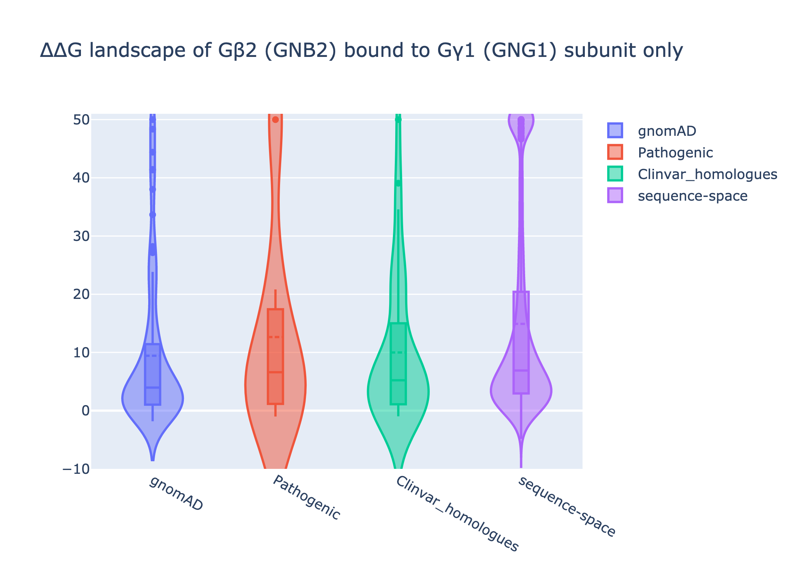
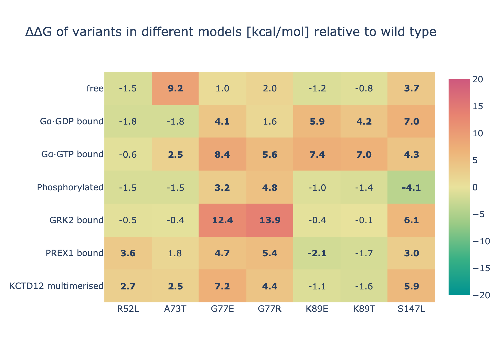
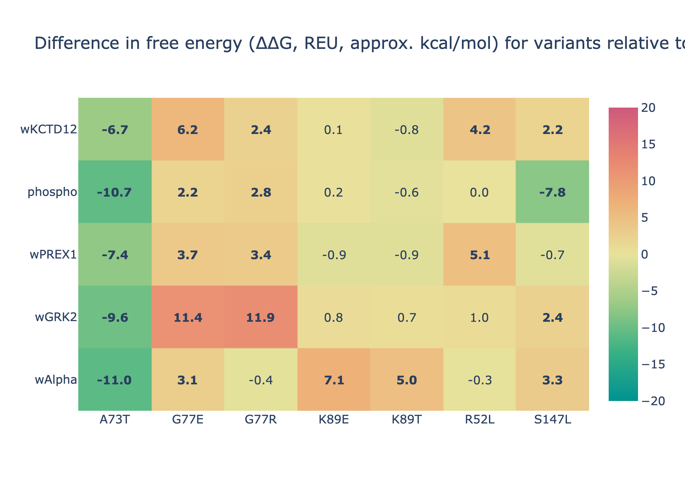

# GNB2_analysis
In silico analysis of the variants for the GNB2 paper.

For Michelanglo interactive page see [michelanglo.sgc.ox.ac.uk](https://michelanglo.sgc.ox.ac.uk/data/2eaec78d-d920-4a92-9780-251f14996b68)
For description of the protein see [description](description.md).

## Templates

In the folder templates are 6 models.

All use the [Swissmodel GNB2 model](https://swissmodel.expasy.org/repository/5e5058728fd6f9e51e1ef5bc.pdb), 
which is based on the 90% identical GNB1 structure (template: chain B of PDB:3CIK)
and are energy minimised with Rosetta using 15 cycles of FastRelax.

See [templates/template_generation.py](templates/template_generation.py) for code.

The models are:

* **unpaired**: β-subunit (GNB2) and γ-subunit (GNG2) of G-protein
* **with Alpha**: β-subunit (GNB2) and γ-subunit (GNG2) with the GDP-bound α-subunit (GNAI1)  based upon PDB:6CRK
* **with GRK2**: β-subunit (GNB2) and γ-subunit (GNG2) with β-adrenergic receptor kinase 1 (GRK2) based upon PDB:3CIK
* **with KCTD12**: complex of multiple β- and γ-subunit with KCTD12 based upon PDB:6M8S
* **with PREX1**: β-subunit (GNB2) and γ-subunit (GNG2)  with PREX1 based upon PDB:6PCV (latter left bovine)
* **phosphorylated**: post-translational modifications taken from Phosphosite Plus

### RASD2

RASD2 (Rhes) has strong homology to solved homologues, except in the GNB2 binding region (C-terminus),
consequently a model could not be made. Literature suggests it is were the alpha helix of the α-subunit.
See [RASD2_notes](RASD2/RASD2_notes.md).

### GTP bound α-subunit

The GDP/GTP binding site of the α-subunit is at the interface:
switching the ligand to GTP makes the interaction between the two subunits weaker.
A model of alpha subunit coupled with GTP in an active form (PDB:5KDL), binding with β-subunit was made for reference purposes
to what residues differ. In fact there is a substational loss of contains in particular with blades 4-5 (such as D186) and D228.
This template was not used in analyses because I thought of it afterwards.

## Mutational landscape

A first course scan was done for all possible single amino acid changes in GNB2.

Rosetta pmut_scan was performed on three of the models in order to get a mutational landscape. This repacks sidechains but does not alter backbones.
Consequently, some mutations that are deleterious are neutral when the backbone is allowed to move.

The full images of the landscapes can be found in [pmut_scan folder)[pmut_scan].

Additionally two sets of violin plots are present. One is the distribution of scores, while the other is the scores subtracted by the unbound model, making it a crude interface score.

Briefly, the violin plots show that most of the gnonAD mutation are both neutral and have no affect on the intereface.
While the pathogenic variants have a strong effect on the interface.
This is in contrast to the set of all possible simple amino acid mutations, which are more frequently deleterious, but do not affect the interface.

## Variant scoring

A second more thorough analysis was done for the pathogenic variants and the gnomAD variants.

The pathogen variants are scored using code for [https://michelanglo.sgc.ox.ac.uk/VENUS](https://michelanglo.sgc.ox.ac.uk/VENUS).
Namely a 4 &Aring; region around the residue of interest is energy minimised by 2x FastRelax and scored. cf. `native_score` below.
This is because VENUS operates on un-minimised PDBs.
Then the residue is mutated and scored (cf. `mutant_score_fixed` below).
After which, the neighbourhood relaxed again (cf. `mutant_score` below).

For the interface, the &beta; chain is yanked away and the model is repacked ("apo" structure in the code) and scored.
The interface score is the difference between the holo and the apo structures.

However, the 2x local FastRelax bound to 4 &Aring; is likely not sufficient to properly account for very large scale backbone changes
as some variants, such as the G77R/E seem to induce.

However, the calculation of the interface score has a problem, as the reported difference of the interface score and the delta should
give all the same interface score for the native wild type for a given template, which they do not.
Consequently, the interface energy will be ignored and instead simply using the difference of the free energy 
for a given template and the energy of the unbound template as done above.

Nevertheless, no clear picture appears.
Also, note that the loss of ubiquitination site K89 is not factored into the calculations.

### Table legend

All numeric values are in Rosetta energy units (approximately kcal/mol).
See [https://michelanglo.sgc.ox.ac.uk/docs/venus](https://michelanglo.sgc.ox.ac.uk/docs/venus) for a description of these.

| Column name | Meaning | Unit |
| ---- | ---- | ---- | 
| model | Template used | - |
| groupname	| gnomAD or pathogenic | - |
| mutation	| Mutation on β-subunit (GNB2) | - |
| ddG | Difference in free energy between the variant in question and a reference (the wild type) | REU. positive = destabilising |
| native_score	| score of the wild type. As there is a tad wastedful minimisation step (for this task) before the mutation the values are not the same (but within error) |  REU. negative value; lower = more stabile |
| mutant_score_fixed | score of the mutant within repacking or relaxing its neighbours |  REU. ditto |
| mutant_score | relaxed mutant |  REU. ditto |
| rmsd | C&alpha; distortion of whole structure relative to wt | &Aring; |
| interface_score | score of components held toghether minus score held apart | REU. negative value; lower = stronger interface |
| interface_Δscore	| difference of the above minus the wt reference* | REU. positive = destabiling |

&lowast;) The `interface_Δscore` ought to be subtrated by the ddG of the mutant on an isolated chain. Which was done at the analysis step.