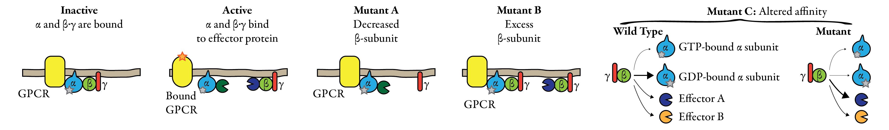

GNB2 is the β subunit of the G-protein G(I)/G(S)/G(T) 
([Uniprot: P62879 <i class="far fa-external-link"></i> ](https://www.uniprot.org/uniprot/P62879)),
which together with the GTP/GDP binding α and the γ subunits form the G-protein complex.

